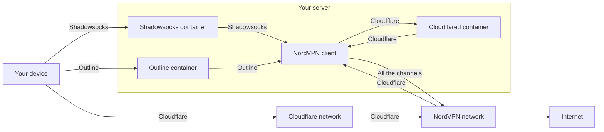

# NordVPN Gateway

NordVPN Gateway is a tool which turns your server into a gateway where NordVPN connection is placed behind different
channels, like standalone [Shadowsocks](https://shadowsocks.org/), [Outline](https://getoutline.org/)
and/or [Cloudflare Zero Trust](https://www.cloudflare.com/zero-trust/). It is useful when you cannot
access [NordVPN](https://nordvpn.com/) directly or do not have a stable connection, but you do love their great
protection including hiding your IP address and other cool features.

## Installation

There are three channels that can be used individually or jointly to access the gateway from your devices:

| Channel               | Difficulty | Access control | Public access to a server  | Requirements                                                                                                                           |
|-----------------------|------------|----------------|----------------------------|----------------------------------------------------------------------------------------------------------------------------------------|
| Shadowsocks           | Low        | One shared key | Required by IP or a domain | Install [Outline Client App](https://getoutline.org/get-started/)                                                                      |
| Outline               | Normal     | Personal keys  | Required by IP or a domain | Install [Outline Manager and Outline Client App](https://getoutline.org/get-started/)                                                  |
| Cloudflare Zero Trust | High       | Advanced       | Not required               | Get a free account for [Cloudflare Zero Trust](https://www.cloudflare.com/zero-trust/) and install [WARP Client App](https://1.1.1.1/) |

> If your server has an ARM processor, you should not choose Outline as a channel during installation because vanilla
> Outline does not support ARM processors. Other channels work perfectly with ARM processors.

1. Make some preparations:
    1. Buy a subscription for [NordVPN](https://nordvpn.com/).
    2. Fulfill the requirements for one or several channels specified in the right column of the table above.
    3. Create a new server based on Ubuntu using [DigitalOcean](https://digitalocean.com/) or another similar service.

2. Connect to the server via SSH and log in as root if needed:

   ```sudo --login```

3. If you have no any possibility to reboot the server without SSH, it is strongly recommended to enable periodic reboot
   server because NordVPN may hang and block access to the server via SSH until reboot (this has happened a couple of
   times on ARM processors). For example, you can do it with a command below every Sunday at 12:00 AM:

   ```(crontab -l 2>/dev/null; echo "@weekly /usr/sbin/reboot --force --force >/dev/null 2>&1") | crontab -```

4. Upgrade the server:

   ```apt update && apt upgrade -y```

5. Configure the server and follow further instructions:

   ```bash -c "$(curl -sSL https://github.com/give-me/vpn/raw/master/install.sh)"```

## Under the hood

After following the instructions mentioned above, the channels configured by you will *automatically* start. After each
rebooting the server, CRON *automatically* runs a script ```/opt/vpn-gateway/bin/gateway.sh``` which configures the
server, connects VPN and checks health periodically. In case of connection loss, the script tries to reconnect VPN and
reboots the server if tryings failed.

A file structure created by this tool during installation or using is as follows:

```
/
├── opt/
│   └── vpn-gateway/
│       ├── settings/         (a place to store channels' settings)
│       ├── data/             (a place to store channels' data)
│       └── bin/
│           ├── gateway.sh    (a task to start the gateway)
│           ├── reinstall.sh  (a task to reinstall this tool)
│           └── uninstall.sh  (a task to uninstall this tool)
└── var/
    └── log/
        └── vpn-gateway.log   (this tool logs events here)
```

Detailed scheme of traffic routing between your device and Internet for each of the channels is shown below:



It is important to note that whereas Shadowsocks and Outline channels require the server to be publicly accessible to
establish connections from your devices to the gateway, Cloudflare Zero Trust channel **can work with any server**, even
a virtual server running locally and inaccessible from the outside.

## Maintain

Important events and useful recommendations for the cases of loosing authorization and other problems will be available
in a log by running ```tail -f /var/log/vpn-gateway.log```. Open ports using by this tool can be found by
running ```ss --processes --listening --tcp```.

In order to reconfigure the gateway *without* updating this tool, just run ```/opt/vpn-gateway/bin/reinstall.sh``` as
root. In order to reconfigure the gateway *with* updating this tool to the latest version, just repeat the 2nd and 5th
steps of the installation guide. Upgrading Shadowsocks and Cloudflared is made during any way of reconfiguration.

## Uninstall

In order to uninstall this tool, just run ```/opt/vpn-gateway/bin/uninstall.sh``` as root. In this case, logging out
from NordVPN is made with a command ```nordvpn logout``` instead of ```nordvpn logout --persist-token``` your token will
expire regardless of which token you specified (expirable in 30 days or non-expirable).

Additionally, if Cloudflare Zero Trust was configured as a channel, you can delete unnecessary API Tokens created upon
request of this tool and available [here](https://dash.cloudflare.com/profile/api-tokens) because Cloudflare set a limit
of API Tokens.