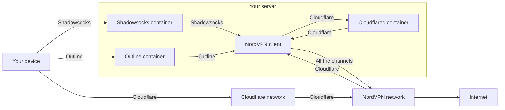

# NordVPN Gateway

If you cannot access [NordVPN](https://nordvpn.com/) directly or do not have a stable connection, but you do love their
great protection including hiding your IP address and other cool features, you can place NordVPN connection behind
standalone [Shadowsocks](https://shadowsocks.org/), [Outline](https://getoutline.org/)
and/or [Cloudflare for Teams](https://www.cloudflare.com/teams/). Just turn your server into a gateway with this tool!

## Usage

There are three channels that can be used individually or jointly to access the gateway from your devices:

| Channel              | Difficulty | Access control | Public access to a server  | Requirements                                                                                                                     |
|----------------------|------------|----------------|----------------------------|----------------------------------------------------------------------------------------------------------------------------------|
| Shadowsocks          | Low        | One shared key | Required by IP or a domain | Install [Outline Client App](https://getoutline.org/get-started/)                                                                |
| Outline              | Normal     | Personal keys  | Required by IP or a domain | Install [Outline Manager and Outline Client App](https://getoutline.org/get-started/)                                            |
| Cloudflare for Teams | High       | Advanced       | Not required               | Get a free account for [Cloudflare for Teams](https://www.cloudflare.com/teams/) and install [WARP Client App](https://1.1.1.1/) |

Detailed scheme of traffic routing between your device and Internet for each of the channels is shown below:



You should not choose Outline as a channel during installation if your server has an ARM processor because vanilla
Outline does not support ARM processors. Other channels work perfectly with ARM processors.

### Install

1. Make some preparations:
    1. Buy a subscription for [NordVPN](https://nordvpn.com/).
    2. Fulfill the requirements for one or several channels specified in the right column of the table above.
    3. Create a new server based on Ubuntu using [DigitalOcean](https://digitalocean.com/) or another similar service.

2. Connect to the server via SSH and log in as root if needed:

   ```sudo --login```

3. Upgrade the server:

   ```apt update && apt upgrade -y```

4. Configure the server and follow further instructions:

   ```bash -c "$(curl -sSL https://github.com/give-me/vpn/raw/master/install.sh)"```

5. Also, NordVPN may hang blocking access to the server via SSH until reboot (this has happened a couple of times on
   ARM processors). So, if you have no any possibility to reboot the server without SSH, it is strongly recommended to
   enable periodic reboot of the server. For example, you can do it with a command below every Sunday at 12:00 AM:

   ```(sudo crontab -l; echo "@weekly /usr/sbin/reboot --force >/dev/null 2>&1") | sudo crontab -```

Later, you can find open ports by running ```ss --processes --listening --tcp``` if you have forgotten them. In order to
change configuration, just repeat the second and fourth steps of this guide.

### Update

In order to update this tool to the latest version, just repeat the second and fourth steps of this guide.

### Uninstall

In order to uninstall this tool, just run ```/opt/vpn-gateway/bin/remove.sh``` as root (do not forget to disconnect VPN
to keep a connection via SSH to the server after uninstalling this tool).