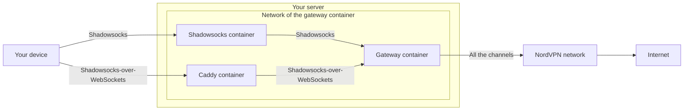

# NordVPN Gateway

NordVPN Gateway is a tool which turns your server into a gateway where NordVPN connection is placed behind different
channels, like standalone [Shadowsocks](https://shadowsocks.org/) and Shadowsocks-over-WebSockets. It is useful when you
cannot access [NordVPN](https://nordvpn.com/) directly or do not have a stable connection, but you do love their great
protection including hiding your IP address and other cool features.

## Installation

There are two channels that can be used individually or jointly to access the gateway from your devices:

| Channel                                 | Difficulty | Access control | Public access to a server  | Requirements                                                      |
|-----------------------------------------|------------|----------------|----------------------------|-------------------------------------------------------------------|
| Shadowsocks (traffic masking available) | Low        | Shared key     | Required by a domain or IP | Install [Outline Client App](https://getoutline.org/get-started/) |
| Shadowsocks-over-WebSockets             | Normal     | Shared key     | Required by a domain only  | Install [Outline Client App](https://getoutline.org/get-started/), point the domain to the server and keep the port 443 free |

1. Make some preparations:
    1. Buy a subscription for [NordVPN](https://nordvpn.com/).
    2. Fulfill the requirements for one or several channels specified in the right column of the table above.
    3. Create a new server based on Ubuntu using [DigitalOcean](https://digitalocean.com/) or another similar service.

2. Connect to the server via SSH and log in as root if needed:

   ```sudo --login```

3. Upgrade the server:

   ```apt update && apt upgrade -y```

4. Configure the server and follow further instructions:

   ```bash -c "$(curl -sSL https://github.com/give-me/vpn/raw/master/install.sh)"```

## Under the hood

Everything runs in Docker containers (Docker is installed from [get.docker.com](https://get.docker.com) if absent),
the routing of the host is left untouched and public ports are published by Docker as usual:

- `gateway` container holds the NordVPN client with its kill switch, so the host is never blocked and SSH always works.
  A script inside the container connects the tunnel, checks every 15 seconds that the tunnel is up and Internet is
  reachable through it, logs in again if NordVPN has logged the gateway out, reconnects when needed, and exits as a
  last resort to be restarted by Docker. While the tunnel is down, the kill switch leaves the channels without
  Internet instead of leaking traffic, and an own firewall rule of the container does the same even if the client is
  not running at all.
- The channels run inside the network of the `gateway` container, so their traffic can go to Internet through the
  tunnel only. Public ports are forwarded by Docker to random internal ports which are the only ones let through the
  kill switch.
- CRON runs `/opt/vpn-gateway/bin/watch.sh` every minute to log changes of the tunnel health, to restart the
  `gateway` container if it stays unhealthy for 10 minutes and to start the channels if they are stopped or Docker
  has restarted the `gateway` container (they lose the network in this case). The channels are never started by
  Docker itself (e.g. after a reboot of the server), only by the watcher and only when the firewall rule of the
  `gateway` container is already in place.

A file structure created by this tool during installation or using is as follows:

```
/
├── opt/
│   └── vpn-gateway/
│       ├── settings/         (a place to store channels' settings)
│       ├── data/             (a place to store channels' data)
│       ├── bin/
│       │   ├── start.sh      (a task to start the gateway)
│       │   ├── watch.sh      (a task to watch the containers)
│       │   ├── reinstall.sh  (a task to reinstall this tool)
│       │   └── uninstall.sh  (a task to uninstall this tool)
│       └── guide.txt         (instructions generated by this tool)
└── var/
    └── log/
        └── vpn-gateway.log   (this tool logs events here)
```

Detailed scheme of traffic routing between your device and Internet for each of the channels is shown below:


```mermaid
flowchart LR
    Y --Shadowsocks-->                 SS --Shadowsocks-->                 VC
    Y --Shadowsocks-over-WebSockets--> WS --Shadowsocks-over-WebSockets--> VC
    VC --All the channels--> VN ---> I

    Y[Your device]
    VN[NordVPN network]
    I[Internet]

    subgraph Your server
        subgraph Network of the gateway container
            SS[Shadowsocks container]
            WS[Caddy container]
            VC[Gateway container]
        end
    end
```

## Maintenance

Instructions generated by this tool can be retrieved anytime by running ```cat /opt/vpn-gateway/guide.txt```. Useful
commands:

- ```docker ps``` shows the containers and health of the tunnel;
- ```docker exec gateway nordvpn status``` shows the current server of the tunnel;
- ```docker logs gateway``` shows events of the tunnel including reconnections and detected leaks;
- ```tail -f /var/log/vpn-gateway.log``` shows events of this tool.

In order to reconfigure the gateway *without* updating this tool, just run ```/opt/vpn-gateway/bin/reinstall.sh``` as
root. In order to reconfigure the gateway *with* updating this tool to the latest version, just repeat the 2nd and 4th
steps of the installation guide. Upgrading NordVPN, Shadowsocks and Caddy is made during any way of reconfiguration.

## Uninstallation

In order to uninstall this tool, just run ```/opt/vpn-gateway/bin/uninstall.sh``` as root. In this case, logging out
from NordVPN is made with a command ```nordvpn logout``` instead of ```nordvpn logout --persist-token```, so your token
will expire regardless of which token you specified (expirable in 30 days or non-expirable).
